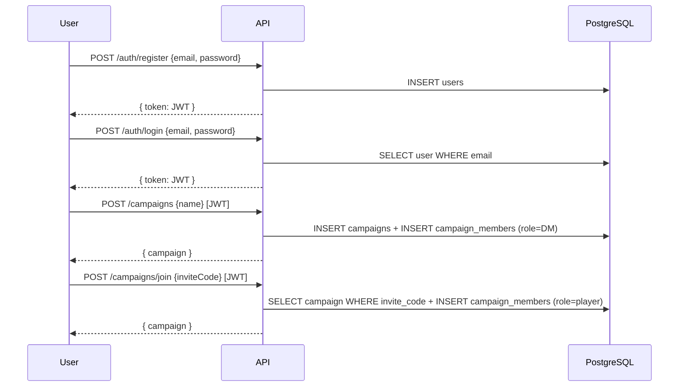

# Spec: Authentication & Campaign Management

**Spec ID:** SPEC-001
**Status:** Draft
**Created:** 2026-03-09
**Last Updated:** 2026-03-09
**Author:** RoleCompanion Team
**Reviewers:** —

---

## 1. Overview

### 1.1 Summary

This spec covers user registration and login, campaign creation and management, and the role system that differentiates Dungeon Masters from Players within a campaign.

### 1.2 Problem Statement

Before any campaign content (characters, notes, monsters) can exist, the system needs to know who the users are and what campaign they belong to. Without a campaign context and a role system, there is no way to control what each user can see or do — e.g., DMs should manage encounters and NPCs while players should only see their own characters and what the DM reveals.

### 1.3 Goals

- [ ] Allow users to register and log in securely.
- [ ] Allow any user to create a campaign (becoming its DM) or join an existing one as a Player.
- [ ] Enforce per-campaign roles: exactly one DM and one or more Players.
- [ ] Provide the auth foundation (JWT) that all other specs depend on.

### 1.4 Non-Goals

- Character sheet creation (SPEC-003).
- Granular content visibility rules (e.g., revealed NPCs) — handled in later specs.
- OAuth / social login (not in scope for initial version).
- Email verification (MAY be added later).

---

## 2. Background & Context

All other features depend on this spec. A `campaign_id` and `user_id` are foreign keys in nearly every other table. The role system (`dungeon_master` vs `player`) is the primary authorization axis for all future specs.

**Related Specs:**
- All other specs depend on SPEC-001.

**References:**
- Architecture proposal (conversation context)
- [5e-database](https://github.com/5e-bits/5e-database) — referenced for later seeding specs

---

## 3. Requirements

### 3.1 Functional Requirements

| ID     | Priority | Requirement |
|--------|----------|-------------|
| FR-001 | MUST     | The system MUST allow a user to register with an email and password. |
| FR-002 | MUST     | The system MUST allow a registered user to log in and receive a JWT. |
| FR-003 | MUST     | The system MUST allow a logged-in user to create a campaign, automatically becoming its Dungeon Master. |
| FR-004 | MUST     | The system MUST allow a logged-in user to join a campaign via an invite code, receiving the Player role. |
| FR-005 | MUST     | Each campaign MUST have exactly one Dungeon Master. |
| FR-006 | MUST     | The system MUST allow the DM to generate and revoke invite codes for their campaign. |
| FR-007 | MUST     | The system MUST allow the DM to remove a player from the campaign. |
| FR-008 | MUST     | The system MUST allow a user to view all campaigns they belong to. |
| FR-009 | SHOULD   | The system SHOULD allow a user to update their display name and password. |
| FR-010 | SHOULD   | The system SHOULD allow the DM to rename or delete their campaign. |
| FR-011 | MAY      | The system MAY support invite links with an expiry time (e.g., 24h, 7d). |

### 3.2 Non-Functional Requirements

| ID      | Category   | Requirement |
|---------|------------|-------------|
| NFR-001 | Security   | Passwords MUST be hashed using bcrypt (cost factor ≥ 12). |
| NFR-002 | Security   | JWTs MUST expire after 7 days and MUST be signed with a secret from environment config. |
| NFR-003 | Security   | All protected endpoints MUST reject requests without a valid JWT with HTTP 401. |
| NFR-004 | Performance | Auth endpoints MUST respond in under 500ms at p95. |

### 3.3 Constraints

- The app is a private tool for a known group; there is no public signup wall needed.
- PostgreSQL is the only database (no separate session store like Redis for now).

---

## 4. User Stories

### US-001: User Registration

**As a** new user,
**I want to** create an account with my email and a password,
**so that** I can access the app and join or create a campaign.

**Acceptance Criteria:**
- [ ] AC-001: Given a valid email and password (≥ 8 chars), when I submit the registration form, then an account is created and I receive a JWT.
- [ ] AC-002: Given an email already in use, when I try to register, then I receive an error saying the email is taken.
- [ ] AC-003: Given a password shorter than 8 characters, when I submit, then I receive a validation error.

---

### US-002: User Login

**As a** registered user,
**I want to** log in with my email and password,
**so that** I can access my campaigns and characters.

**Acceptance Criteria:**
- [ ] AC-001: Given valid credentials, when I log in, then I receive a JWT valid for 7 days.
- [ ] AC-002: Given wrong credentials, when I log in, then I receive an HTTP 401 with a generic error (no hint about which field is wrong).

---

### US-003: Create Campaign

**As a** logged-in user,
**I want to** create a new campaign with a name,
**so that** I become its Dungeon Master and can invite my players.

**Acceptance Criteria:**
- [ ] AC-001: Given I am logged in, when I create a campaign with a name, then the campaign is created and I am assigned the `dungeon_master` role in it.
- [ ] AC-002: Given I create a campaign, then an invite code is automatically generated for it.
- [ ] AC-003: Given a campaign name longer than 100 characters, when I submit, then I receive a validation error.

---

### US-004: Join Campaign

**As a** logged-in user,
**I want to** join an existing campaign using an invite code,
**so that** I can participate as a player.

**Acceptance Criteria:**
- [ ] AC-001: Given a valid invite code, when I submit it, then I am added to the campaign with the `player` role.
- [ ] AC-002: Given I am already a member of the campaign, when I submit the invite code, then I receive an error saying I am already a member.
- [ ] AC-003: Given an invalid or expired invite code, when I submit it, then I receive an appropriate error.

---

### US-005: Manage Campaign Members (DM)

**As a** Dungeon Master,
**I want to** view, invite, and remove players from my campaign,
**so that** I control who has access to the campaign.

**Acceptance Criteria:**
- [ ] AC-001: Given I am the DM, when I view the campaign settings, then I can see a list of all members with their roles.
- [ ] AC-002: Given I am the DM, when I regenerate the invite code, then the old code is invalidated and a new one is created.
- [ ] AC-003: Given I am the DM, when I remove a player, then they lose access to the campaign immediately.
- [ ] AC-004: Given I am a player (not DM), when I try to remove a member, then I receive an HTTP 403.

---

## 5. Design

### 5.1 High-Level Flow



### 5.2 Data Model

```typescript
interface User {
  id: string;           // UUID
  email: string;        // unique
  password_hash: string;
  display_name: string;
  created_at: Date;
  updated_at: Date;
}

interface Campaign {
  id: string;           // UUID
  name: string;         // max 100 chars
  invite_code: string;  // unique, random 8-char alphanumeric
  invite_expires_at: Date | null;
  created_at: Date;
  updated_at: Date;
}

interface CampaignMember {
  id: string;           // UUID
  campaign_id: string;  // FK → campaigns.id
  user_id: string;      // FK → users.id
  role: 'dungeon_master' | 'player';
  joined_at: Date;
  // UNIQUE (campaign_id, user_id)
}
```

### 5.3 API Design

#### Auth

**`POST /api/v1/auth/register`**
```json
// Request
{ "email": "user@example.com", "password": "secret123", "displayName": "Gandalf" }

// Response 201
{ "token": "<JWT>", "user": { "id": "...", "email": "...", "displayName": "..." } }
```

**`POST /api/v1/auth/login`**
```json
// Request
{ "email": "user@example.com", "password": "secret123" }

// Response 200
{ "token": "<JWT>", "user": { "id": "...", "email": "...", "displayName": "..." } }
```

#### Campaigns

**`POST /api/v1/campaigns`** _(auth required)_
```json
// Request
{ "name": "The Lost Mines of Phandelver" }

// Response 201
{ "id": "...", "name": "...", "inviteCode": "AB12CD34", "role": "dungeon_master" }
```

**`POST /api/v1/campaigns/join`** _(auth required)_
```json
// Request
{ "inviteCode": "AB12CD34" }

// Response 200
{ "id": "...", "name": "...", "role": "player" }
```

**`GET /api/v1/campaigns`** _(auth required)_
```json
// Response 200
[
  { "id": "...", "name": "...", "role": "dungeon_master", "memberCount": 4 },
  { "id": "...", "name": "...", "role": "player", "memberCount": 5 }
]
```

**`GET /api/v1/campaigns/:id/members`** _(auth required, must be member)_
```json
// Response 200
[
  { "userId": "...", "displayName": "Gandalf", "role": "dungeon_master" },
  { "userId": "...", "displayName": "Frodo", "role": "player" }
]
```

**`DELETE /api/v1/campaigns/:id/members/:userId`** _(auth required, DM only)_
```json
// Response 204 No Content
```

**`POST /api/v1/campaigns/:id/invite/regenerate`** _(auth required, DM only)_
```json
// Response 200
{ "inviteCode": "XY99ZZ11" }
```

### 5.4 JWT Payload

```json
{
  "sub": "<user_id>",
  "email": "user@example.com",
  "displayName": "Gandalf",
  "iat": 1741478400,
  "exp": 1742083200
}
```

### 5.5 Error Handling

| Error Case | Behavior | HTTP Code |
|------------|----------|-----------|
| Email already registered | `{ "error": "EMAIL_TAKEN" }` | 409 |
| Invalid credentials | `{ "error": "INVALID_CREDENTIALS" }` | 401 |
| Missing / invalid JWT | `{ "error": "UNAUTHORIZED" }` | 401 |
| Insufficient role (not DM) | `{ "error": "FORBIDDEN" }` | 403 |
| Campaign not found | `{ "error": "NOT_FOUND" }` | 404 |
| Invalid invite code | `{ "error": "INVALID_INVITE_CODE" }` | 400 |
| Already a member | `{ "error": "ALREADY_MEMBER" }` | 409 |
| Validation error | `{ "error": "VALIDATION_ERROR", "fields": { ... } }` | 400 |

---

## 6. Testing Strategy

### 6.1 Unit Tests

- [ ] Password hashing — bcrypt hash is produced and verified correctly.
- [ ] JWT generation — token contains correct payload and expiry.
- [ ] JWT verification — expired or tampered tokens are rejected.
- [ ] Invite code generation — produces an 8-char alphanumeric string, unique per call.

### 6.2 Integration Tests

- [ ] Register → Login → receive valid JWT flow.
- [ ] Create campaign → invite code generated automatically.
- [ ] Join campaign with valid invite code → member added with `player` role.
- [ ] DM removes player → player can no longer access campaign.
- [ ] Non-DM attempts to remove member → 403.
- [ ] Regenerate invite code → old code invalidated.

### 6.3 Edge Cases

- [ ] Duplicate email registration returns 409.
- [ ] Login with wrong password returns 401 (not a hint about which field).
- [ ] Joining a campaign you are already in returns 409.
- [ ] DM cannot remove themselves from their own campaign.
- [ ] Accessing protected endpoints without JWT returns 401.

---

## 7. Security Considerations

- [ ] Passwords are hashed with bcrypt (cost ≥ 12) — never stored in plaintext.
- [ ] JWT secret is stored in environment variables, never hardcoded.
- [ ] Error messages for login do not reveal whether the email exists.
- [ ] Invite codes are cryptographically random (not sequential or guessable).
- [ ] All campaign-scoped endpoints verify the requesting user is a member of that campaign before proceeding.
- [ ] DM-only endpoints verify the `dungeon_master` role explicitly (not just membership).

---

## 8. Implementation Plan

| Task | Description | Depends On |
|------|-------------|------------|
| T-01 | Initialize monorepo (pnpm workspaces, `apps/api`, `apps/web`, `packages/db`) | — |
| T-02 | Set up PostgreSQL + Drizzle ORM schema (`users`, `campaigns`, `campaign_members`) | T-01 |
| T-03 | Write and run initial DB migration | T-02 |
| T-04 | Implement `POST /auth/register` and `POST /auth/login` with bcrypt + JWT | T-03 |
| T-05 | Implement auth middleware (JWT verification, attach user to request context) | T-04 |
| T-06 | Implement campaign CRUD endpoints (create, list, get members) | T-05 |
| T-07 | Implement join campaign + invite code regeneration | T-06 |
| T-08 | Implement remove member endpoint (DM only) | T-06 |
| T-09 | Write unit + integration tests for auth and campaign endpoints | T-04–T-08 |
| T-10 | Build frontend: Register / Login pages + JWT storage (httpOnly cookie or memory) | T-04 |
| T-11 | Build frontend: Campaign list, create campaign, join campaign UI | T-06, T-07 |
| T-12 | Build frontend: Campaign settings page (members list, invite code, remove player) | T-08 |

---

## 9. Open Questions

| # | Question | Owner | Status | Resolution |
|---|----------|-------|--------|------------|
| 1 | Should JWTs be stored in httpOnly cookies (more secure) or in memory/localStorage (simpler)? | Team | Open | — |
| 2 | Should invite codes have expiry enabled by default, or only optionally? | Team | Open | — |
| 3 | Can a user be a DM in one campaign and a Player in another? | Team | Open | — |

---

## 10. Decision Log

| Date | Decision | Rationale | Alternatives Considered |
|------|----------|-----------|-------------------------|
| 2026-03-09 | JWT for auth (not sessions) | Stateless; no Redis needed at this stage; works well with monorepo | Server-side sessions, OAuth |
| 2026-03-09 | Invite code join model | Simple UX for small groups; avoids email flows | Email invites, link sharing |
| 2026-03-09 | One DM per campaign (not transferable in this spec) | Simplifies authorization model | Transferable DM role |

---

## 11. Changelog

| Version | Date | Author | Summary |
|---------|------|--------|---------|
| 0.1 | 2026-03-09 | RoleCompanion Team | Initial draft |
