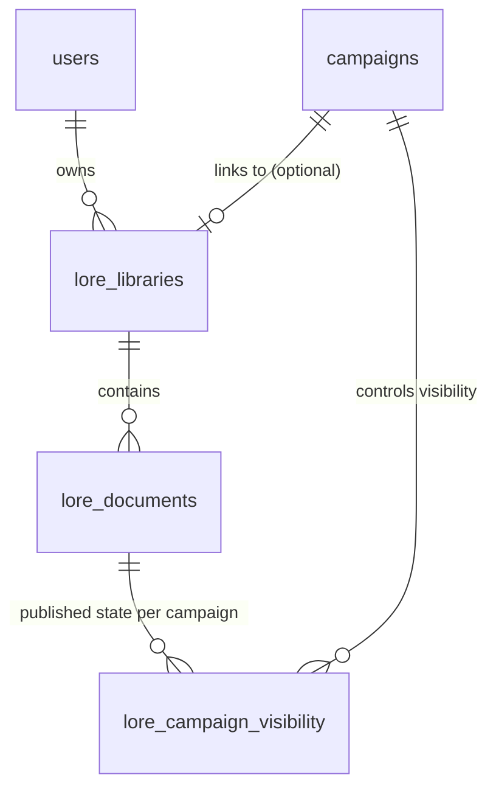

# Spec: Campaigns & Lore by User

**Spec ID:** SPEC-010
**Status:** Draft
**Created:** 2026-03-12
**Last Updated:** 2026-03-12
**Author:** RoleCompanion Team
**Reviewers:** —

---

## 1. Overview

### 1.1 Summary

This spec redesigns the World Lore ownership model so that lore documents (world settings, history, factions, locations) belong to a **User** rather than a **Campaign**. A user-owned lore library can then be linked to one or more campaigns, allowing the same world setting to underpin multiple campaigns without duplicating content.

### 1.2 Problem Statement

Currently, lore documents are campaign-scoped (`lore_documents.campaignId`). When a DM runs multiple campaigns in the same world — e.g., two parties exploring the same setting in parallel — they must duplicate every lore document across campaigns. Any update to world lore must be applied in every campaign separately. This wastes effort and causes lore drift between campaigns.

### 1.3 Goals

- [ ] Allow a user (DM) to create a **Lore Library** that exists independently of any campaign.
- [ ] Allow a DM to link a Lore Library to one or more campaigns as the world setting base.
- [ ] Preserve existing per-campaign visibility controls (published/unpublished per-campaign).
- [ ] Allow a campaign to optionally inherit a lore library without a hard dependency.
- [ ] Migrate existing `lore_documents` data safely to the new user-scoped model.

### 1.4 Non-Goals

- Real-time collaborative editing of lore documents.
- Per-player selective reveal within a single lore document (section-level visibility) — deferred.
- File upload (PDF, Docx) — deferred.
- Sharing a lore library between users (e.g., co-DMs) — deferred.

---

## 2. Background & Context

SPEC-009 defined the initial lore document model: campaign-scoped documents with DM-controlled `isPublished` visibility. This spec refactors that ownership model without changing the authoring or visibility workflow from the user's perspective.

**Related Specs:**
- SPEC-001 — Auth & Campaign Management (users, campaigns, roles).
- SPEC-009 — World Setting & Lore (initial campaign-scoped implementation being refactored here).

---

## 3. Requirements

### 3.1 Functional Requirements

| ID     | Priority | Requirement |
|--------|----------|-------------|
| FR-001 | MUST     | A user MUST be able to create a Lore Library with a name and optional description. |
| FR-002 | MUST     | A user MUST be able to create, edit, and delete lore documents within their own Lore Library. |
| FR-003 | MUST     | A DM MUST be able to link a Lore Library (their own) to a campaign as its world setting. |
| FR-004 | MUST     | A DM MUST be able to unlink a Lore Library from a campaign without deleting the library. |
| FR-005 | MUST     | A campaign MAY have zero or one linked Lore Library. |
| FR-006 | MUST     | Per-campaign `isPublished` visibility MUST be preserved: each document in a library has a separate published flag per campaign it is linked to. |
| FR-007 | MUST     | Campaign members MUST be able to list and read published lore documents for their campaign's linked library. |
| FR-008 | MUST     | The DM MUST be able to list all documents (published and unpublished) in the linked library. |
| FR-009 | SHOULD   | Members SHOULD be able to search lore documents by keyword within the campaign's linked library. |
| FR-010 | MUST     | The system MUST migrate existing `lore_documents` rows to the new model without data loss. |
| FR-011 | MAY      | A user MAY list all their own Lore Libraries across campaigns. |

### 3.2 Non-Functional Requirements

| ID      | Category    | Requirement |
|---------|-------------|-------------|
| NFR-001 | Privacy     | Unpublished documents MUST NOT be readable by players via the API, even if the document exists in the library. |
| NFR-002 | Performance | List and detail endpoints MUST respond in under 300ms. |
| NFR-003 | Integrity   | Unlinking a Lore Library from a campaign MUST NOT delete the library or its documents. |
| NFR-FE  | Frontend Errors | Frontend pages MUST display an inline error message when page-load API calls fail. Pages MUST NOT silently redirect away on load errors. |

### 3.3 Constraints

- A Lore Library is owned by a user; only that user may create/edit/delete documents within it.
- A campaign can only link a library owned by its DM (preventing players from injecting lore).
- The per-campaign visibility state (`isPublished`) is separate from the document itself — the same document may be published in campaign A and unpublished in campaign B.

---

## 4. User Stories

### US-001: DM Creates a Lore Library

**As a** Dungeon Master,
**I want to** create a Lore Library called "The Realm of Eldoria",
**so that** I can store world-building documents I'll reuse across campaigns.

**Acceptance Criteria:**
- [ ] AC-001: Given I am logged in, when I POST a Lore Library with a name, it is created and associated with my user account.
- [ ] AC-002: Given the library is created, I can list my libraries and see "The Realm of Eldoria".

---

### US-002: DM Links a Library to a Campaign

**As a** Dungeon Master,
**I want to** link my "The Realm of Eldoria" library to "Campaign: The Lost Mines",
**so that** players in that campaign can browse the world lore.

**Acceptance Criteria:**
- [ ] AC-001: Given I am the DM of a campaign and own a library, when I link the library to the campaign, it becomes the campaign's world setting.
- [ ] AC-002: Given the campaign is linked, players can see published lore documents from the library.
- [ ] AC-003: Given I link the same library to a second campaign, lore is available in both campaigns independently.

---

### US-003: DM Reuses Library Across Campaigns

**As a** Dungeon Master,
**I want to** run two parallel campaigns in the same world,
**so that** both groups explore the same lore without me duplicating documents.

**Acceptance Criteria:**
- [ ] AC-001: Given library L is linked to campaign A and campaign B, when I update a document in L, both campaigns see the updated content.
- [ ] AC-002: Given document D is published in campaign A but unpublished in campaign B, players in A can read D while players in B cannot.

---

### US-004: Campaign Without a Lore Library

**As a** Dungeon Master,
**I want to** run a campaign without any world lore,
**so that** the lore section is optional and does not clutter the interface.

**Acceptance Criteria:**
- [ ] AC-001: Given a campaign has no linked library, the lore section is hidden or shows an empty state for all members.

---

## 5. Design

### 5.1 High-Level Design



### 5.2 Data Model

New table: **`lore_libraries`**
```typescript
interface LoreLibrary {
  id: string;          // UUID
  ownerId: string;     // FK → users.id
  name: string;        // max 200 chars
  description: string; // optional, markdown
  createdAt: Date;
  updatedAt: Date;
}
```

Modified table: **`lore_documents`** — remove `campaignId`, add `libraryId`
```typescript
interface LoreDocument {
  id: string;          // UUID
  libraryId: string;   // FK → lore_libraries.id (replaces campaignId)
  authorId: string;    // FK → users.id (must be library owner)
  title: string;       // max 200 chars
  content: string;     // markdown text
  createdAt: Date;
  updatedAt: Date;
  // NOTE: isPublished moves to lore_campaign_visibility
}
```

New table: **`lore_campaign_visibility`** — per-campaign publish state
```typescript
interface LoreCampaignVisibility {
  id: string;         // UUID
  documentId: string; // FK → lore_documents.id
  campaignId: string; // FK → campaigns.id
  isPublished: boolean;
  updatedAt: Date;
}
```

Modified table: **`campaigns`** — add optional `loreLibraryId`
```typescript
// campaigns gets a new nullable column:
loreLibraryId: string | null; // FK → lore_libraries.id (SET NULL on delete)
```

### 5.3 API Design

**`POST /api/v1/lore-libraries`** _(auth)_
```json
// Request
{ "name": "The Realm of Eldoria", "description": "A high-fantasy world..." }
// Response 201
{ "id": "...", "ownerId": "...", "name": "The Realm of Eldoria" }
```

**`GET /api/v1/lore-libraries`** _(auth)_ — list own libraries
```json
[{ "id": "...", "name": "The Realm of Eldoria", "description": "...", "createdAt": "..." }]
```

**`PATCH /api/v1/lore-libraries/:libId`** _(auth, owner)_
```json
{ "name": "Updated Name" }
```

**`DELETE /api/v1/lore-libraries/:libId`** _(auth, owner)_ — also unlinks from all campaigns; `204`

**`POST /api/v1/campaigns/:id/lore-library`** _(auth, DM)_ — link library to campaign
```json
{ "libraryId": "uuid" }
// Response 200
{ "campaignId": "...", "loreLibraryId": "uuid" }
```

**`DELETE /api/v1/campaigns/:id/lore-library`** _(auth, DM)_ — unlink library; `204`

**`GET /api/v1/campaigns/:id/lore`** _(auth, campaign member)_
- DM: returns all documents in linked library (published + unpublished), with `isPublished` per-campaign.
- Player: returns only published documents.
- Returns `[]` if no library is linked.

**`GET /api/v1/campaigns/:id/lore/:docId`** _(auth, campaign member)_
- DM: can read any document in the linked library.
- Player: 403 if document is not published for this campaign.

**`POST /api/v1/lore-libraries/:libId/documents`** _(auth, owner)_
```json
{ "title": "History of Eldoria", "content": "Long ago..." }
// Response 201 — document created (not published in any campaign by default)
```

**`PATCH /api/v1/lore-libraries/:libId/documents/:docId`** _(auth, owner)_
```json
{ "title": "Updated title", "content": "New content..." }
```

**`DELETE /api/v1/lore-libraries/:libId/documents/:docId`** _(auth, owner)_ — `204`

**`PATCH /api/v1/campaigns/:id/lore/:docId/visibility`** _(auth, DM)_ — toggle publish per campaign
```json
{ "isPublished": true }
// Response 200
```

### 5.4 Error Handling

| Error Case | Code | HTTP |
|------------|------|------|
| Player reads unpublished document | `FORBIDDEN` | 403 |
| Non-owner tries to edit library/document | `FORBIDDEN` | 403 |
| DM links library they do not own | `FORBIDDEN` | 403 |
| Library not found | `NOT_FOUND` | 404 |
| Document not found | `NOT_FOUND` | 404 |
| Campaign has no linked library | returns `[]` on list | 200 |

---

## 6. Testing Strategy

### 6.1 Unit Tests

- [ ] Library ownership guard — only owner can edit documents.
- [ ] Visibility guard — player cannot read unpublished documents.
- [ ] DM cannot link a library they do not own.

### 6.2 Integration Tests

- [ ] Create library → link to campaign → player list returns 0 (all unpublished).
- [ ] DM publishes document for campaign A → player in A sees it; player in B does not.
- [ ] Unlink library from campaign → lore list returns [].
- [ ] Delete library → campaign loreLibraryId becomes null.
- [ ] Same library linked to two campaigns → visibility state is independent per campaign.
- [ ] Non-member cannot access campaign lore → 404.
- [ ] Unauthenticated request → 401.

### 6.3 Edge Cases

- [ ] Campaign with no linked library returns empty list (not 404).
- [ ] Linking a library already linked to another campaign succeeds.
- [ ] Deleting a document removes its `lore_campaign_visibility` rows.

---

## 7. Security Considerations

- [ ] Unpublished document visibility is enforced server-side per campaign.
- [ ] Only the library owner may create, edit, or delete documents.
- [ ] Only the campaign DM may link/unlink a library, and only a library they own.
- [ ] Campaign membership is verified on every request accessing campaign lore.

---

## 8. Implementation Plan

| Task | Description | Depends On |
|------|-------------|------------|
| T-01 | Schema: add `lore_libraries` table | SPEC-001 T-01 |
| T-02 | Schema: add `loreLibraryId` nullable FK to `campaigns` | T-01 |
| T-03 | Schema: refactor `lore_documents` — replace `campaignId` with `libraryId`; remove `isPublished` | T-01 |
| T-04 | Schema: add `lore_campaign_visibility` table | T-03 |
| T-05 | Migration: create new tables and columns | T-01–T-04 |
| T-06 | Migration: data migration — wrap existing `lore_documents` into auto-created libraries per DM | T-05 |
| T-07 | API: Lore Library CRUD (`lore-libraries.ts`) | T-05 |
| T-08 | API: campaign lore link/unlink endpoints | T-07 |
| T-09 | API: refactor `lore.ts` — use `libraryId` + `lore_campaign_visibility` | T-07, T-08 |
| T-10 | API: visibility toggle endpoint (`PATCH .../lore/:docId/visibility`) | T-09 |
| T-11 | Register updated routes in `app.ts` | T-07–T-10 |
| T-12 | Unit + integration tests | T-09, T-10 |
| T-13 | Frontend: Lore Library management page | T-07 |
| T-14 | Frontend: campaign lore page — link library, browse docs, toggle visibility | T-08–T-10 |

---

## 9. Open Questions

| # | Question | Owner | Status | Resolution |
|---|----------|-------|--------|------------|
| 1 | Should a campaign be allowed to link multiple libraries (e.g., main world + expansion)? | Team | Open | — |
| 2 | Should the data migration auto-create one library per DM or one per campaign? | Team | Open | — |
| 3 | Should visibility toggle be part of the document PATCH or a separate endpoint? | Team | Open | — |

---

## 10. Decision Log

| Date | Decision | Rationale | Alternatives Considered |
|------|----------|-----------|-------------------------|
| 2026-03-12 | Introduce `lore_campaign_visibility` junction table | Decouples document existence from per-campaign publish state; supports multi-campaign reuse | Embed visibility map as JSONB in `lore_documents` |
| 2026-03-12 | Campaign links at most one library | Keeps the UI simple; multiple libraries can be merged at the library level | Allow N libraries per campaign |

---

## 11. Changelog

| Version | Date | Author | Summary |
|---------|------|--------|---------|
| 0.1 | 2026-03-12 | RoleCompanion Team | Initial draft — refactor lore ownership from campaign to user |
