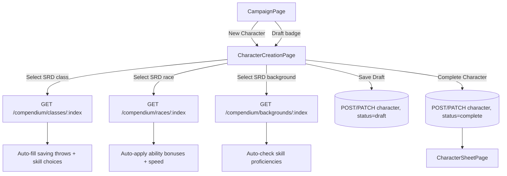

# Spec: Character Creation Refactor

**Spec ID:** SPEC-020
**Status:** Draft
**Created:** 2026-03-12
**Last Updated:** 2026-03-12
**Author:** JDebon
**Reviewers:** —

---

## 1. Overview

### 1.1 Summary

Replace the current inline character creation modal with a dedicated full-page creation experience that mirrors `CharacterSheetPage`. The page supports a **hybrid class/race/background catalog**: SRD entries (already seeded) are the base, and DM-created Custom Content entities supplement or override them. Selecting an SRD-backed option auto-populates saving throws, skill proficiency choices, ability bonuses, and speed. Characters can be saved as **draft** at any point and **completed** when ready, which locks the identity fields (class, race, background).

### 1.2 Problem Statement

The current "New Character" modal has two problems:

1. **UX:** It is a cramped, one-shot form — no incremental saving, no auto-suggestions, disconnected from how the sheet looks once created.
2. **Data integrity:** Class, race, and background are free-text, allowing values that mistype SRD names or fall outside the DM's campaign setting. Neither the SRD catalog nor DM-approved options are surfaced to the player.

### 1.3 Goals

- [ ] Replace the creation modal with a full-page experience visually consistent with `CharacterSheetPage`.
- [ ] Populate class, race, and background from a **merged catalog**: SRD entries + DM Custom Content entities of type `class`, `race`, `background`.
- [ ] Auto-populate saving throw proficiencies, skill proficiency choices, ability score bonuses, and speed when an SRD-backed option is selected.
- [ ] Support saving a character as **draft** (all fields editable) and **completing** it (locks identity fields).

### 1.4 Non-Goals

- Full automatic proficiency and feature population for custom (non-SRD-backed) entries — those require manual input.
- Auto-population of class features (Rage, Sneak Attack, etc.) — SRD fixtures do not include feature descriptions.
- Multiclassing during creation.
- Spell slot table population at creation — handled post-completion in SPEC-005.
- Migrating existing characters to draft/complete — they default to `complete`.

---

## 2. Background & Context

**Related Specs:**
- SPEC-003: Character Sheet — `characters` table, `CharacterSheetPage`, `CreateCharacterInput`.
- SPEC-006: Custom Content — `custom_entities` table with `entityType` enum and `baseIndex` FK to SRD entries.
- SPEC-002: SRD Compendium — `srd_classes`, `srd_races`, `srd_backgrounds` tables, each with a `data JSONB` column containing the full fixture payload.

**Relevant SRD data available per entity type:**

| Type | Auto-populatable fields |
|---|---|
| Class | `saving_throws[]` (deterministic), `proficiency_choices[]` (player picks N from list), `hit_die` |
| Race | `ability_bonuses[]` (deterministic), `speed` (deterministic), `traits[]` (name only — no descriptions) |
| Background | `starting_proficiencies[]` (deterministic skill profs) |

**Custom Content relationship:**
`custom_entities` has a nullable `base_index` column. When a DM creates a custom class based on an SRD class (e.g., a reskinned Fighter), `base_index = 'fighter'`. The creation page can look up the SRD entry via `base_index` to perform auto-population. Custom entities with no `base_index` are fully manual.

**`entityTypeEnum` gap:** The current enum only covers `['monster', 'item', 'rule']`. It must be extended to `['monster', 'item', 'rule', 'class', 'race', 'background']` so the DM can create custom class/race/background entities.

**Current compendium generic endpoint** (`GET /api/v1/compendium/:collection`) returns only `index` + `name` — not the full `data` payload. A new detail endpoint is needed to fetch SRD data for auto-population on selection.

---

## 3. Requirements

### 3.1 Functional Requirements

| ID     | Priority | Requirement |
|--------|----------|-------------|
| FR-001 | MUST     | The `entityTypeEnum` MUST be extended to include `'class'`, `'race'`, and `'background'`, allowing DMs to create Custom Content of these types. |
| FR-002 | MUST     | The system MUST add a `status` column (`'draft'` \| `'complete'`) to the `characters` table, defaulting to `'complete'` for backward compatibility. |
| FR-003 | MUST     | `POST /api/v1/campaigns/:id/characters` MUST accept an optional `status` field (default `'complete'`). |
| FR-004 | MUST     | `PATCH /api/v1/characters/:id` MUST allow `'draft'` → `'complete'` status transitions and MUST reject `'complete'` → `'draft'` with HTTP 400. |
| FR-005 | MUST     | When `status = 'complete'`, `className`, `raceName`, and `backgroundName` MUST be read-only on both the creation page and `CharacterSheetPage`. |
| FR-006 | MUST     | The "New Character" button on `CampaignPage` MUST navigate to `/campaigns/:id/characters/new`. |
| FR-007 | MUST     | The creation page MUST render a layout visually consistent with `CharacterSheetPage` (same card structure, ability score display with live modifiers, skill/saving-throw proficiency toggles, backstory/traits). |
| FR-008 | MUST     | The creation page MUST include a "Save Draft" button (`POST` on first save, `PATCH` on subsequent saves) that does not lock fields. |
| FR-009 | MUST     | The creation page MUST include a "Complete Character" button that transitions `status` to `'complete'` and redirects to `CharacterSheetPage`. |
| FR-010 | MUST     | Class, race, and background MUST be `<select>` dropdowns. Each dropdown MUST show a **merged list** of: all SRD entries for that type + all campaign Custom Content entities of that type, grouped by source ("SRD" / "Custom"). |
| FR-011 | MUST     | A new endpoint `GET /api/v1/compendium/classes/:index`, `GET /api/v1/compendium/races/:index`, and `GET /api/v1/compendium/backgrounds/:index` MUST return the full SRD `data` payload for a given entry (used for auto-population on selection). |
| FR-012 | MUST     | When a **class** is selected from the SRD list, the form MUST auto-populate: saving throw proficiencies (checked), and present the skill proficiency choice UI (choose N from allowed list). |
| FR-013 | MUST     | When a **race** is selected from the SRD list, the form MUST auto-apply ability score bonuses to the ability score inputs and auto-fill the speed field. |
| FR-014 | MUST     | When a **background** is selected from the SRD list, the form MUST auto-check the corresponding skill proficiencies. |
| FR-015 | MUST     | When a Custom Content entity with a `baseIndex` is selected, the form MUST auto-populate using the linked SRD entry's data (same rules as FR-012–FR-014). |
| FR-016 | MUST     | When a Custom Content entity with no `baseIndex` is selected, auto-population MUST NOT occur — the player fills proficiencies manually. |
| FR-017 | MUST     | If no entries exist in a dropdown (no SRD entries and no custom content for that type), the dropdown MUST show a disabled placeholder: "No options available". |
| FR-018 | MUST     | Draft characters MUST show a "Draft" badge in the campaign character list. Clicking a draft MUST navigate to the creation page pre-populated with saved data. |
| FR-019 | SHOULD   | When a class has `proficiency_choices`, the UI SHOULD render a multi-select picker showing the allowed skills and the number to choose, preventing selection of more than allowed. |
| FR-020 | SHOULD   | The "Complete Character" button SHOULD be disabled until minimum required fields are filled: name, class, race, and max HP. |
| FR-021 | MAY      | After auto-population, the player MAY manually override any auto-filled field before completing. |

### 3.2 Non-Functional Requirements

| ID      | Category    | Requirement |
|---------|-------------|-------------|
| NFR-001 | Consistency | The creation page visual language MUST match `CharacterSheetPage`. |
| NFR-002 | Performance | SRD detail fetch on selection MUST be a single request; MUST NOT block the rest of the form. |
| NFR-FE  | Frontend Errors | Pages MUST display inline errors on API failure. MUST NOT silently redirect on load errors. Only redirect on confirmed 401/403. |

### 3.3 Constraints

- SRD data lives in `data JSONB` on `srd_classes`, `srd_races`, `srd_backgrounds`. No schema changes to those tables — only new API endpoints to expose detail.
- `entityTypeEnum` is a Postgres enum; extending it requires a migration.
- The `status` transition is enforced server-side.

---

## 4. User Stories

### US-001: Save a character in progress

**As a** player,
**I want to** save my character without filling everything in at once,
**so that** I can return later and finish at my own pace.

**Acceptance Criteria:**
- [ ] AC-001: Given I enter a name and click "Save Draft", then the character is saved with `status = 'draft'` and the page stays open.
- [ ] AC-002: Given I return to the campaign page, then my character appears with a "Draft" badge.
- [ ] AC-003: Given I click the draft, then the creation page opens pre-populated with my saved data.

### US-002: Complete a character

**As a** player,
**I want to** lock in my class, race, and background once decided,
**so that** I and the DM can trust those choices are final.

**Acceptance Criteria:**
- [ ] AC-001: Given name, class, race, and max HP are filled, when I click "Complete Character", then `status = 'complete'` and I am redirected to the character sheet.
- [ ] AC-002: Given the character is complete, when I view the sheet, then class/race/background are read-only text.

### US-003: Auto-populate from SRD class selection

**As a** player,
**I want** saving throws and skill options to be pre-filled when I pick a class,
**so that** I don't need to cross-reference the rulebook.

**Acceptance Criteria:**
- [ ] AC-001: Given I select "Barbarian" (SRD), then STR and CON saving throws are automatically checked.
- [ ] AC-002: Given I select "Barbarian" (SRD), then a skill picker appears showing "Choose 2 from: Animal Handling, Athletics, Intimidation, Nature, Perception, Survival".
- [ ] AC-003: Given I select a custom class with `baseIndex = 'barbarian'`, then the same auto-population occurs.
- [ ] AC-004: Given I select a custom class with no `baseIndex`, then no auto-population occurs.

### US-004: Auto-populate from SRD race selection

**As a** player,
**I want** ability score bonuses and speed auto-applied when I pick a race,
**so that** I don't have to manually add racial bonuses.

**Acceptance Criteria:**
- [ ] AC-001: Given I select "Dwarf" (SRD), then CON is increased by 2 in the ability score inputs and speed is set to 25.
- [ ] AC-002: Given I change race, the previous auto-applied bonuses are reversed before the new ones are applied.

### US-005: SRD + Custom Content merged dropdown

**As a** player,
**I want to** see both SRD options and campaign-specific options in one dropdown,
**so that** I can choose homebrew content the DM has set up without losing access to standard options.

**Acceptance Criteria:**
- [ ] AC-001: Given the DM has created a custom class "Artificer" and the SRD is seeded, then the class dropdown shows all SRD classes grouped under "SRD" and "Artificer" grouped under "Custom".
- [ ] AC-002: Given no custom classes exist, the dropdown shows only SRD classes with no "Custom" group.

---

## 5. Design

### 5.1 High-Level Design

```
CampaignPage
  └─ "New Character" → /campaigns/:id/characters/new
  └─ Draft badge click → /campaigns/:id/characters/new?draft=:characterId

CharacterCreationPage
  ├─ Header: name input | "Save Draft" | "Complete Character"
  ├─ Identity card
  │    ├─ Class <select>  [SRD group + Custom group]  → on select: fetch SRD detail → auto-fill
  │    ├─ Race <select>   [SRD group + Custom group]  → on select: fetch SRD detail → auto-fill
  │    ├─ Background <select> [SRD + Custom]          → on select: fetch SRD detail → auto-fill
  │    └─ Level input
  ├─ Ability Scores card  (live modifiers; race bonuses shown as delta)
  ├─ Combat Stats card    (Max HP, AC, Speed — speed auto-filled from race)
  ├─ Skill Proficiency card
  │    ├─ Class skill picker: "Choose N from: [list]" (when class has proficiency_choices)
  │    └─ Background profs: auto-checked, still toggleable
  ├─ Saving Throws card   (auto-checked from class, still toggleable)
  └─ Backstory & Traits card

CharacterSheetPage (modified)
  └─ status === 'complete': class/race/background → <span> not <input>
```



### 5.2 Data Model

**Migration A: `0008_character_status.sql`**

```sql
ALTER TABLE characters
  ADD COLUMN status TEXT NOT NULL DEFAULT 'complete'
  CHECK (status IN ('draft', 'complete'));
```

**Migration B: `0009_entity_type_class_race_background.sql`**

```sql
ALTER TYPE entity_type ADD VALUE 'class';
ALTER TYPE entity_type ADD VALUE 'race';
ALTER TYPE entity_type ADD VALUE 'background';
```

> Note: Postgres enum additions are non-transactional in older versions but safe in PG 12+. These two `ALTER TYPE` statements must be run outside an explicit transaction block, or in separate migration files if the migration runner wraps each file in a transaction.

**Updated types (frontend `client.ts`):**

```typescript
export interface CharacterSheet {
  // ... existing fields ...
  status: 'draft' | 'complete'
}

export interface CharacterSummary {
  // ... existing fields ...
  status: 'draft' | 'complete'
}
```

### 5.3 API / Interface Design

**New: `GET /api/v1/compendium/classes/:index`**
**New: `GET /api/v1/compendium/races/:index`**
**New: `GET /api/v1/compendium/backgrounds/:index`**

Returns the full SRD `data` JSONB for the given entry. Used by the creation page to auto-populate on selection.

Response (class example):
```json
{
  "index": "barbarian",
  "name": "Barbarian",
  "data": {
    "hit_die": 12,
    "saving_throws": [{ "index": "str" }, { "index": "con" }],
    "proficiency_choices": [{
      "choose": 2,
      "from": { "options": [{ "item": { "index": "skill-athletics" } }, ...] }
    }]
  }
}
```

**New: `GET /api/v1/campaigns/:id/character-options?type=class|race|background`**

Returns a merged, grouped list of SRD entries and campaign custom entities for a given type. Used to populate the dropdowns.

Response:
```json
{
  "srd": [
    { "index": "barbarian", "name": "Barbarian", "source": "srd" }
  ],
  "custom": [
    { "id": "uuid", "name": "Artificer", "source": "custom", "baseIndex": null }
  ]
}
```

**Modified: `POST /api/v1/campaigns/:id/characters`**

Accepts optional `status` (defaults to `'complete'`).

**Modified: `PATCH /api/v1/characters/:id`**

Accepts `status`; rejects `'complete'` → `'draft'` with HTTP 400.

### 5.4 Auto-population Logic (Frontend)

When the player selects a dropdown option:

1. If `source === 'srd'` → fetch `GET /api/v1/compendium/:type/:index`, then apply:
   - **Class**: check `saving_throws` → mark those saving throw profs; build skill choice picker from `proficiency_choices`.
   - **Race**: add `ability_bonuses` to current ability score inputs (tracking delta for reversal on change); set speed from `speed`.
   - **Background**: check `starting_proficiencies` → mark those skill profs.

2. If `source === 'custom'` and `baseIndex != null` → fetch `GET /api/v1/compendium/:type/:baseIndex`, apply same logic.

3. If `source === 'custom'` and `baseIndex == null` → no auto-population; leave fields as-is.

When the player changes their selection, previously auto-applied values are reversed before applying the new selection.

### 5.5 Error Handling

| Error Case | Behavior | HTTP Code |
|---|---|---|
| `'complete'` → `'draft'` PATCH | Validation error returned | 400 |
| "Complete" with missing required fields | Inline error, no navigation | 400 |
| SRD detail fetch fails on selection | Toast error "Could not load defaults — fill manually"; form stays interactive | — |
| Character options fetch fails | Dropdowns show disabled "Failed to load options" | — |

---

## 6. Testing Strategy

### 6.1 API Tests

- [ ] `GET /api/v1/compendium/classes/:index` returns full `data` payload.
- [ ] `GET /api/v1/campaigns/:id/character-options?type=class` returns merged SRD + custom list.
- [ ] `POST` character with `status: 'draft'` → returns `status: 'draft'`.
- [ ] `POST` character without `status` → returns `status: 'complete'` (backward compat).
- [ ] `PATCH` draft → `complete` succeeds.
- [ ] `PATCH` complete → `draft` returns 400.
- [ ] Character list includes `status` on each summary.
- [ ] Character options endpoint scopes custom entities to campaign.

### 6.2 Edge Cases

- [ ] No custom entities of a type → dropdown shows only SRD entries; no "Custom" group rendered.
- [ ] Custom entity with `baseIndex` → auto-population uses the SRD base data.
- [ ] Player changes class after auto-population → previous saving throw / skill selections are cleared before new ones applied.
- [ ] Existing characters (pre-migration) → `status: 'complete'`, unaffected.
- [ ] Postgres enum migration runs cleanly in isolated test DB.

---

## 7. Security Considerations

- [ ] Only campaign members can call the character options endpoint; DM-only custom content respects SPEC-006 visibility rules.
- [ ] Only the character owner (or DM) can PATCH character status — existing auth from SPEC-003 applies.
- [ ] `complete → draft` reversal blocked server-side, not only in the UI.

---

## 8. Implementation Plan

| Task | Description | Depends On |
|------|-------------|------------|
| T-01 | DB migration A: add `status` column to `characters` | — |
| T-02 | DB migration B: extend `entity_type` enum with `class`, `race`, `background` | — |
| T-03 | Update Drizzle schema for both migrations | T-01, T-02 |
| T-04 | API: add `GET /compendium/:type/:index` detail endpoints for classes, races, backgrounds | T-03 |
| T-05 | API: add `GET /campaigns/:id/character-options?type=` merged endpoint | T-03 |
| T-06 | API: accept `status` on POST character; enforce transition on PATCH | T-03 |
| T-07 | API: include `status` in character list + detail responses | T-03 |
| T-08 | API tests | T-04, T-05, T-06, T-07 |
| T-09 | Frontend: `CharacterCreationPage` at `/campaigns/:id/characters/new` (layout only) | — |
| T-10 | Frontend: merged dropdown component with SRD/Custom grouping | T-05 |
| T-11 | Frontend: auto-population logic on class/race/background selection | T-04, T-10 |
| T-12 | Frontend: skill proficiency choice picker (choose N from list) | T-09 |
| T-13 | Frontend: "Save Draft" logic (POST first, PATCH subsequent) | T-07 |
| T-14 | Frontend: "Complete Character" logic (validate → PATCH status → redirect) | T-13 |
| T-15 | Frontend: read-only identity fields on `CharacterSheetPage` when `status = 'complete'` | T-07 |
| T-16 | Frontend: "Draft" badge + draft navigation in campaign character list | T-07 |
| T-17 | Frontend: update `CampaignPage` "New Character" to navigate instead of modal | — |

---

## 9. Open Questions

| # | Question | Owner | Status | Resolution |
|---|----------|-------|--------|------------|
| 1 | Should the DM be able to revert a complete character to draft (e.g., for a rebuild)? | JDebon | Open | — |
| 2 | Should draft characters be visible to all party members, or only to the owner and DM? | JDebon | Open | — |
| 3 | Minimum required fields for "Complete Character": proposed name + class + race + maxHp. Confirm? | JDebon | Open | — |
| 4 | When the player changes class mid-creation after having manually edited auto-filled fields, should we re-apply auto-population (overwriting edits) or skip? | JDebon | Open | — |
| 5 | Postgres enum migration: do we need to split `0008` and `0009` into separate migration files due to transaction wrapping in our custom migrator? | JDebon | Open | — |

---

## 10. Decision Log

| Date | Decision | Rationale | Alternatives Considered |
|------|----------|-----------|-------------------------|
| 2026-03-12 | Hybrid catalog: SRD base + DM custom content | SRD gives rich auto-population; custom content extends for homebrew — no either/or | SRD only; custom content only |
| 2026-03-12 | Auto-population via on-demand detail fetch (not preloaded) | Keeps dropdown load fast; detail is only fetched when the user actually selects an option | Preload all SRD detail at page mount |
| 2026-03-12 | One-way `draft → complete` transition | Prevents players from re-opening locked identity choices; DM can delete+recreate if needed | Allow DM to revert |
| 2026-03-12 | Extend `entityTypeEnum` rather than a new table | Reuses SPEC-006 infrastructure; DM already knows how to create custom content | Separate `campaign_class_options` table |
| 2026-03-12 | Creation page mirrors `CharacterSheetPage` layout | What you build is what you'll see; reuses design primitives | Wizard/step-by-step form |

---

## 11. Changelog

| Version | Date | Author | Summary |
|---------|------|--------|---------|
| 0.1 | 2026-03-12 | JDebon | Initial draft — SRD-selector approach |
| 0.2 | 2026-03-12 | JDebon | Rewrite: draft/complete status, DM custom content dropdowns, sheet-like layout |
| 0.3 | 2026-03-12 | JDebon | Hybrid model: SRD + custom content merged catalog, auto-population from SRD data, extend entityTypeEnum |
