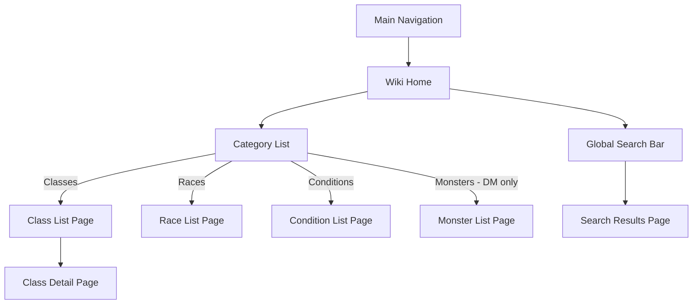

# Spec: Wiki Companion Feature

**Spec ID:** SPEC-021
**Status:** Draft
**Created:** 2026-03-12
**Last Updated:** 2026-03-12
**Author:** RoleCompanion Team
**Reviewers:** —

---

## 1. Overview

### 1.1 Summary

This spec introduces an in-app **Wiki Companion** — a searchable, role-aware reference browser that lets players and DMs look up 5e 2014 SRD content without leaving the app. Players see general-use content (classes, races, backgrounds, items, conditions, rules). DMs additionally see content that would reveal spoilers to players (monsters/creatures, traps, DM-specific rules).

### 1.2 Problem Statement

During play, users frequently need to look up rules, item descriptions, spell effects, class features, and conditions. Without an in-app reference, players and DMs navigate to external sites (D&D Beyond, Roll20, PDFs) which breaks focus and takes them out of the app. The SRD data is already seeded locally (SPEC-002), making a fast in-app wiki achievable without external API calls.

### 1.3 Goals

- [ ] Provide a searchable wiki accessible from the campaign or global navigation.
- [ ] Allow players to browse: classes, races, backgrounds, equipment, magic items, spells, conditions, rules, skills.
- [ ] Allow DMs to additionally browse: monsters/creatures and any DM-sensitive content.
- [ ] Support full-text search across all accessible wiki entries.
- [ ] Render SRD content (markdown/structured JSON) in a clean, readable format.

### 1.4 Non-Goals

- Editing or overriding SRD content from the wiki view (that is Custom Content — SPEC-006).
- User-contributed wiki pages or annotations — deferred.
- PDF/external content indexing — deferred.
- Per-campaign wiki customization (hiding classes, etc.) — deferred.
- Offline mode / service worker caching — deferred.

---

## 2. Background & Context

The SRD compendium API (SPEC-002) already exposes search endpoints for spells, monsters, equipment, magic items, classes, races, backgrounds, conditions, and skills. The Wiki Companion is a read-only frontend browser over those existing endpoints, with role-based filtering applied at the UI layer (and enforced at the API layer for DM-only content like monsters).

**Related Specs:**
- SPEC-002 — SRD Compendium (data source and existing search API).
- SPEC-003 — Character Sheet (character creation references wiki entries via SPEC-020).
- SPEC-006 — Custom Content (complements the wiki; custom entities extend SRD entries).

---

## 3. Requirements

### 3.1 Functional Requirements

| ID     | Priority | Requirement |
|--------|----------|-------------|
| FR-001 | MUST     | All authenticated users MUST be able to access the Wiki Companion from the main navigation. |
| FR-002 | MUST     | The wiki MUST provide browsable categories: Classes, Races, Backgrounds, Equipment, Magic Items, Spells, Conditions, Skills. |
| FR-003 | MUST     | DMs MUST additionally see a Monsters/Creatures category. |
| FR-004 | MUST     | Each category MUST display a paginated or scrollable list of all entries with name and key attributes. |
| FR-005 | MUST     | Selecting an entry MUST display its full detail view rendered from the SRD `data` JSONB field. |
| FR-006 | MUST     | The wiki MUST support keyword search across all accessible categories simultaneously (global search). |
| FR-007 | SHOULD   | Each category page SHOULD support filtering by relevant attributes (e.g., spell level, school; equipment category; monster CR). |
| FR-008 | SHOULD   | The wiki SHOULD be accessible both from within a campaign context and from a top-level global route. |
| FR-009 | MAY      | The wiki MAY deep-link between related entries (e.g., a class entry links to its spell list). |
| FR-010 | MAY      | The wiki MAY display custom content (SPEC-006) created for the current campaign alongside SRD entries. |

### 3.2 Non-Functional Requirements

| ID      | Category    | Requirement |
|---------|-------------|-------------|
| NFR-001 | Performance | Category list pages MUST load within 500ms. Search results MUST appear within 300ms of input. |
| NFR-002 | Security    | Monster stat blocks MUST NOT be returned by the API to non-DM users (enforced server-side). |
| NFR-003 | UX          | The wiki MUST be usable on mobile viewports. |
| NFR-004 | Accessibility | Text contrast and keyboard navigation MUST meet WCAG 2.1 Level AA. |
| NFR-FE  | Frontend Errors | Page-load API errors MUST display an inline error message. Pages MUST NOT silently redirect on load errors. |

### 3.3 Constraints

- The wiki is read-only. No creation, editing, or deletion of SRD content from this interface.
- Monster content visibility is enforced at the API layer; the frontend filters only as a UX convenience.
- The wiki consumes existing compendium API endpoints (SPEC-002) — no new API endpoints are required for the base implementation.

---

## 4. User Stories

### US-001: Player Looks Up a Condition

**As a** Player,
**I want to** look up the "Poisoned" condition during combat,
**so that** I know what penalties it applies without leaving the app.

**Acceptance Criteria:**
- [ ] AC-001: Given I navigate to the Wiki, when I open the Conditions category, I see "Poisoned" in the list.
- [ ] AC-002: Given I click "Poisoned", I see its full description rendered from the SRD.
- [ ] AC-003: Given I am a player, the Monsters category is not visible in the wiki navigation.

---

### US-002: DM Looks Up a Monster

**As a** Dungeon Master,
**I want to** look up a monster's stat block during session prep,
**so that** I have all the information I need without switching to an external tool.

**Acceptance Criteria:**
- [ ] AC-001: Given I am a DM, when I open the Wiki, I see a Monsters category.
- [ ] AC-002: Given I search "goblin", the monster "Goblin" appears in the results with its CR and type.
- [ ] AC-003: Given I click "Goblin", I see its full stat block including HP, AC, attacks, and abilities.
- [ ] AC-004: Given a player makes the same search, monsters do NOT appear in their results.

---

### US-003: User Searches Across All Categories

**As a** Player or DM,
**I want to** type a search term in the wiki search bar,
**so that** I can quickly find entries across all categories without browsing each one.

**Acceptance Criteria:**
- [ ] AC-001: Given I type "fire" in the global search, I see results from Spells (Fireball, Fire Bolt), Equipment (any fire-related items), and Conditions — but not monsters (if I am a player).
- [ ] AC-002: Given I type "fire" as a DM, monster results (e.g., Fire Giant, Fire Elemental) also appear.
- [ ] AC-003: Given there are no results for my query, an empty state message is shown.

---

### US-004: Player Browses Classes

**As a** Player,
**I want to** browse the Classes section of the wiki,
**so that** I can read about class features when leveling up or planning a character.

**Acceptance Criteria:**
- [ ] AC-001: Given I open the Classes category, I see all 12 SRD base classes listed.
- [ ] AC-002: Given I click "Ranger", I see the Ranger class description, hit die, proficiencies, and feature list.

---

## 5. Design

### 5.1 High-Level Design

The wiki is a set of read-only frontend pages backed by the existing compendium API. Role-based visibility is enforced server-side; the frontend additionally hides the Monsters nav item from players.



### 5.2 Data Model

No new database tables. The wiki reads from existing SRD tables:
- `srd_classes`, `srd_races`, `srd_backgrounds`
- `srd_spells`, `srd_equipment`, `srd_magic_items`
- `srd_conditions`, `srd_skills`
- `srd_monsters` (DM only)

### 5.3 API / Interface Design

The wiki reuses existing compendium API endpoints (SPEC-002). Server-side enforcement:
- `GET /api/v1/compendium/monsters` and `GET /api/v1/compendium/monsters/:index` — require the requesting user to be a DM in at least one campaign (or the route is DM-role-gated within a campaign context).

No new endpoints are required for the initial implementation.

**Potential new endpoint for global cross-category search:**

`GET /api/v1/compendium/search?q=<term>` _(auth)_
- Returns aggregated results across all accessible categories.
- DM results include monsters; player results exclude monsters.
- Response format:
```json
{
  "results": [
    { "category": "spells", "index": "fireball", "name": "Fireball" },
    { "category": "equipment", "index": "torch", "name": "Torch" }
  ]
}
```

### 5.4 Frontend Route Structure

| Route | Component | Access |
|-------|-----------|--------|
| `/wiki` | `WikiHomePage` | All authenticated users |
| `/wiki/classes` | `WikiCategoryPage` | All |
| `/wiki/classes/:index` | `WikiDetailPage` | All |
| `/wiki/races` | `WikiCategoryPage` | All |
| `/wiki/races/:index` | `WikiDetailPage` | All |
| `/wiki/backgrounds` | `WikiCategoryPage` | All |
| `/wiki/backgrounds/:index` | `WikiDetailPage` | All |
| `/wiki/spells` | `WikiCategoryPage` | All |
| `/wiki/spells/:index` | `WikiDetailPage` | All |
| `/wiki/equipment` | `WikiCategoryPage` | All |
| `/wiki/equipment/:index` | `WikiDetailPage` | All |
| `/wiki/magic-items` | `WikiCategoryPage` | All |
| `/wiki/magic-items/:index` | `WikiDetailPage` | All |
| `/wiki/conditions` | `WikiCategoryPage` | All |
| `/wiki/conditions/:index` | `WikiDetailPage` | All |
| `/wiki/monsters` | `WikiCategoryPage` | DM only (hidden for players) |
| `/wiki/monsters/:index` | `WikiDetailPage` | DM only |
| `/wiki/search` | `WikiSearchPage` | All (filtered by role) |

### 5.5 Error Handling

| Error Case | Behavior | HTTP Code |
|------------|----------|-----------|
| Player accesses `/wiki/monsters` | Redirect to `/wiki` with "Not found" message | 403 (server) |
| Entry not found | Inline "Entry not found" message on detail page | 404 |
| Search returns no results | Inline empty state message | 200 |
| API fetch failure | Inline error message on page; no silent redirect | 500 |

---

## 6. Testing Strategy

### 6.1 Unit Tests

- [ ] Role-based nav rendering — Monsters link hidden for player role.
- [ ] `WikiDetailPage` — renders SRD JSON data fields correctly.
- [ ] Global search component — fires request on input debounce.

### 6.2 Integration Tests

- [ ] Player cannot access monster list or detail API endpoints → 403.
- [ ] DM can access monster list and detail endpoints → 200.
- [ ] Class list page loads all SRD classes.
- [ ] Class detail page renders class data for a known class index.
- [ ] Global search `?q=fire` returns spells and equipment; excludes monsters for player.
- [ ] Global search as DM includes monster results.

### 6.3 Edge Cases

- [ ] Search with special characters (e.g., `?q=half-elf`) returns correct results.
- [ ] Empty search query returns empty results or a prompt.
- [ ] Unknown category in URL → 404 page.
- [ ] SRD entry with missing optional fields renders without crashing.

---

## 7. Security Considerations

- [ ] Monster API endpoints enforce DM-only access server-side; frontend restriction is for UX only.
- [ ] All wiki routes require authentication; unauthenticated requests receive 401.
- [ ] SRD data is read-only; no mutation endpoints are exposed through the wiki.
- [ ] User-provided search queries are parameterized (no SQL injection risk via existing `ILIKE` pattern).

---

## 8. Implementation Plan

| Task | Description | Depends On |
|------|-------------|------------|
| T-01 | Add `/wiki` route and `WikiHomePage` with category grid | — |
| T-02 | Add `/wiki/:category` route and `WikiCategoryPage` (generic list + filters) | T-01 |
| T-03 | Add `/wiki/:category/:index` route and `WikiDetailPage` (renders SRD JSON) | T-02 |
| T-04 | Implement role-based category visibility (hide Monsters nav for players) | T-01 |
| T-05 | Add monster DM-only guard at API level (if not already present in SPEC-002) | SPEC-002 |
| T-06 | Implement global search bar and `/wiki/search` route | T-02 |
| T-07 | Add `GET /api/v1/compendium/search?q=` cross-category endpoint | SPEC-002 |
| T-08 | Add Wiki link to main navigation | T-01 |
| T-09 | Unit tests: role-based nav, detail rendering | T-03, T-04 |
| T-10 | Integration tests: player/DM access, search results | T-06, T-07 |

---

## 9. Open Questions

| # | Question | Owner | Status | Resolution |
|---|----------|-------|--------|------------|
| 1 | Should the wiki be accessible outside a campaign context (global route) or only within a campaign? | Team | Open | — |
| 2 | Should DM monster access require being a DM in any campaign, or specifically the current campaign? | Team | Open | — |
| 3 | Should custom entities (SPEC-006) appear alongside SRD entries in the wiki? | Team | Open | — |
| 4 | Should the wiki have a dedicated top-level nav item or live within the campaign sidebar? | Team | Open | — |

---

## 10. Decision Log

| Date | Decision | Rationale | Alternatives Considered |
|------|----------|-----------|-------------------------|
| 2026-03-12 | Reuse existing compendium API endpoints | No new backend work needed for basic implementation; wiki is a UI concern | New dedicated wiki API |
| 2026-03-12 | Monster access controlled by DM role server-side | Security-first: frontend filter is just UX; API must enforce | Frontend-only filter |

---

## 11. Changelog

| Version | Date | Author | Summary |
|---------|------|--------|---------|
| 0.1 | 2026-03-12 | RoleCompanion Team | Initial draft — role-aware SRD wiki browser |
