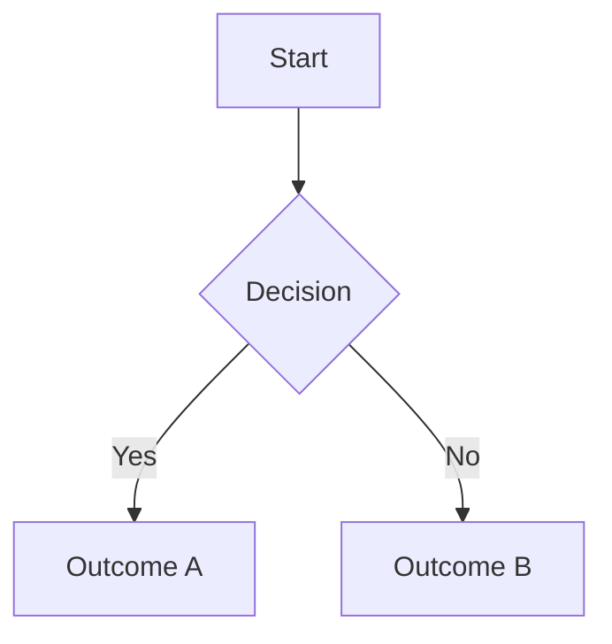

# Spec: [Feature Name]

**Spec ID:** SPEC-XXX
**Status:** Draft | Review | Approved | Implemented | Deprecated
**Created:** YYYY-MM-DD
**Last Updated:** YYYY-MM-DD
**Author:** [Name]
**Reviewers:** [Names]

---

## 1. Overview

### 1.1 Summary

> One or two sentences describing what this spec covers and why it exists.

### 1.2 Problem Statement

> Describe the problem being solved. What pain point, gap, or user need does this address? Be concrete — avoid vague statements like "improve UX".

### 1.3 Goals

- [ ] Goal 1: What this spec aims to achieve.
- [ ] Goal 2: ...

### 1.4 Non-Goals

> Explicitly list what this spec does NOT cover to prevent scope creep.

- Not in scope: ...
- Not in scope: ...

---

## 2. Background & Context

> Provide any necessary context: prior decisions, related specs, existing system behavior, or domain knowledge a reader needs to understand this spec. Link to related specs using their IDs.

**Related Specs:**
- SPEC-XXX: [Title]

**References:**
- [Link or document name]

---

## 3. Requirements

Requirements use the RFC 2119 keywords: **MUST**, **MUST NOT**, **SHOULD**, **SHOULD NOT**, **MAY**.

### 3.1 Functional Requirements

| ID     | Priority | Requirement                                              |
|--------|----------|----------------------------------------------------------|
| FR-001 | MUST     | The system MUST ...                                      |
| FR-002 | MUST     | The system MUST ...                                      |
| FR-003 | SHOULD   | The system SHOULD ...                                    |
| FR-004 | MAY      | The system MAY ...                                       |

### 3.2 Non-Functional Requirements

| ID      | Category        | Requirement                                             |
|---------|-----------------|---------------------------------------------------------|
| NFR-001 | Performance     | Response time MUST be under X ms for Y% of requests.   |
| NFR-002 | Security        | All user data MUST be encrypted at rest.                |
| NFR-003 | Scalability     | The system SHOULD handle up to N concurrent users.      |
| NFR-004 | Accessibility   | UI MUST conform to WCAG 2.1 Level AA.                   |
| NFR-005 | Reliability     | Uptime MUST be ≥ 99.9% measured monthly.               |

### 3.3 Constraints

> Hard constraints imposed by technology, business, regulation, or time.

- Constraint 1: ...
- Constraint 2: ...

---

## 4. User Stories

> Use the format: "As a [persona], I want to [action] so that [benefit]."
> Each story maps to one or more acceptance criteria.

### US-001: [Short title]

**As a** [persona],
**I want to** [action],
**so that** [benefit].

**Acceptance Criteria:**
- [ ] AC-001: Given [context], when [action], then [expected outcome].
- [ ] AC-002: Given [context], when [action], then [expected outcome].

### US-002: [Short title]

**As a** [persona],
**I want to** [action],
**so that** [benefit].

**Acceptance Criteria:**
- [ ] AC-001: Given [context], when [action], then [expected outcome].

---

## 5. Design

### 5.1 High-Level Design

> Describe the approach at a conceptual level. Include diagrams where helpful (ASCII or Mermaid).



### 5.2 Data Model

> Describe new or modified data structures, schemas, or entities.

```typescript
// Example
interface ExampleEntity {
  id: string;
  name: string;
  createdAt: Date;
}
```

### 5.3 API / Interface Design

> Describe any public interfaces, API endpoints, events, or contracts this feature exposes or modifies.

**Endpoint:** `POST /api/v1/example`

Request:
```json
{
  "field": "value"
}
```

Response:
```json
{
  "id": "abc123",
  "field": "value"
}
```

### 5.4 Error Handling

> Define expected error cases and how they should be handled.

| Error Case          | Behavior                                  | HTTP Code / Signal |
|---------------------|-------------------------------------------|--------------------|
| Invalid input       | Return validation error with field detail | 400                |
| Unauthorized        | Reject with auth error                    | 401                |
| Resource not found  | Return not-found error                    | 404                |

---

## 6. Testing Strategy

### 6.1 Unit Tests

> List key units to be tested in isolation.

- [ ] Test: [component/function] — [what is being verified]
- [ ] Test: ...

### 6.2 Integration Tests

- [ ] Test: [flow/scenario] — [what is being verified end-to-end]
- [ ] Test: ...

### 6.3 Edge Cases

> List edge cases that MUST be covered by tests.

- [ ] Edge case: Empty input
- [ ] Edge case: Maximum allowed input size
- [ ] Edge case: Concurrent requests
- [ ] Edge case: ...

---

## 7. Security Considerations

> Identify potential attack surfaces, sensitive data, or trust boundaries introduced by this feature.

- [ ] Input is validated and sanitized before use.
- [ ] No sensitive data is logged or exposed in error messages.
- [ ] Authentication and authorization are enforced on all protected routes.
- [ ] [Any feature-specific concern]

---

## 8. Implementation Plan

> Break the implementation into ordered tasks. Each task should be independently testable where possible.

| Task | Description                              | Depends On |
|------|------------------------------------------|------------|
| T-01 | [Setup / scaffolding]                    | —          |
| T-02 | [Core logic]                             | T-01       |
| T-03 | [API layer]                              | T-02       |
| T-04 | [UI / integration]                       | T-03       |
| T-05 | [Tests]                                  | T-02, T-03 |

---

## 9. Open Questions

> Questions that are not yet resolved. Each should be assigned to someone and have a target resolution date.

| # | Question                                  | Owner  | Status | Resolution |
|---|-------------------------------------------|--------|--------|------------|
| 1 | Should X or Y approach be used for Z?     | [Name] | Open   | —          |
| 2 | What is the rate limit for this endpoint? | [Name] | Open   | —          |

---

## 10. Decision Log

> Record significant decisions made during the spec lifecycle and their rationale.

| Date       | Decision                                  | Rationale                        | Alternatives Considered |
|------------|-------------------------------------------|----------------------------------|-------------------------|
| YYYY-MM-DD | Chose approach A over approach B          | Lower complexity, meets NFR-001  | Approach B, Approach C  |

---

## 11. Changelog

| Version | Date       | Author | Summary of Changes          |
|---------|------------|--------|-----------------------------|
| 0.1     | YYYY-MM-DD | [Name] | Initial draft               |
